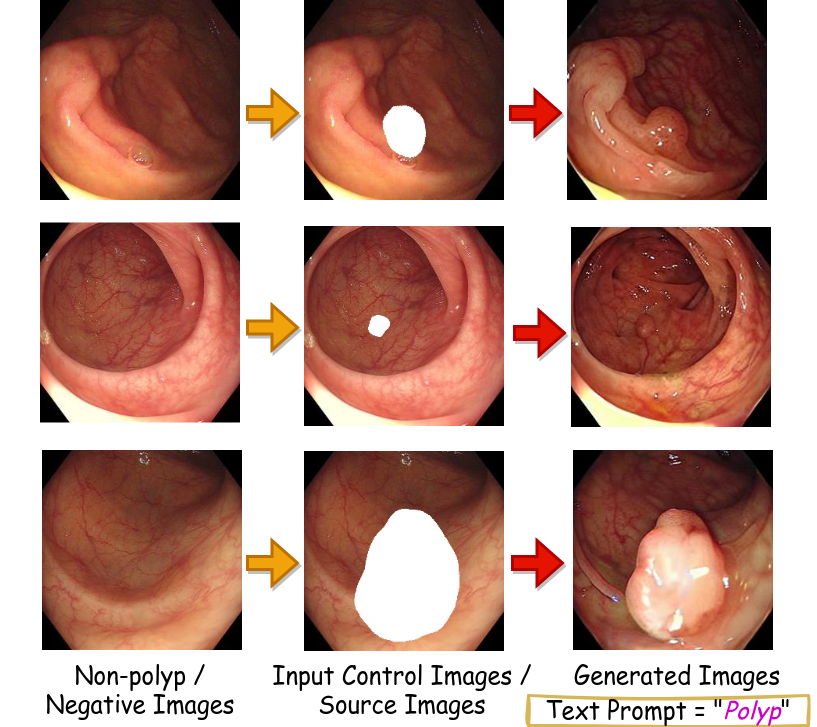
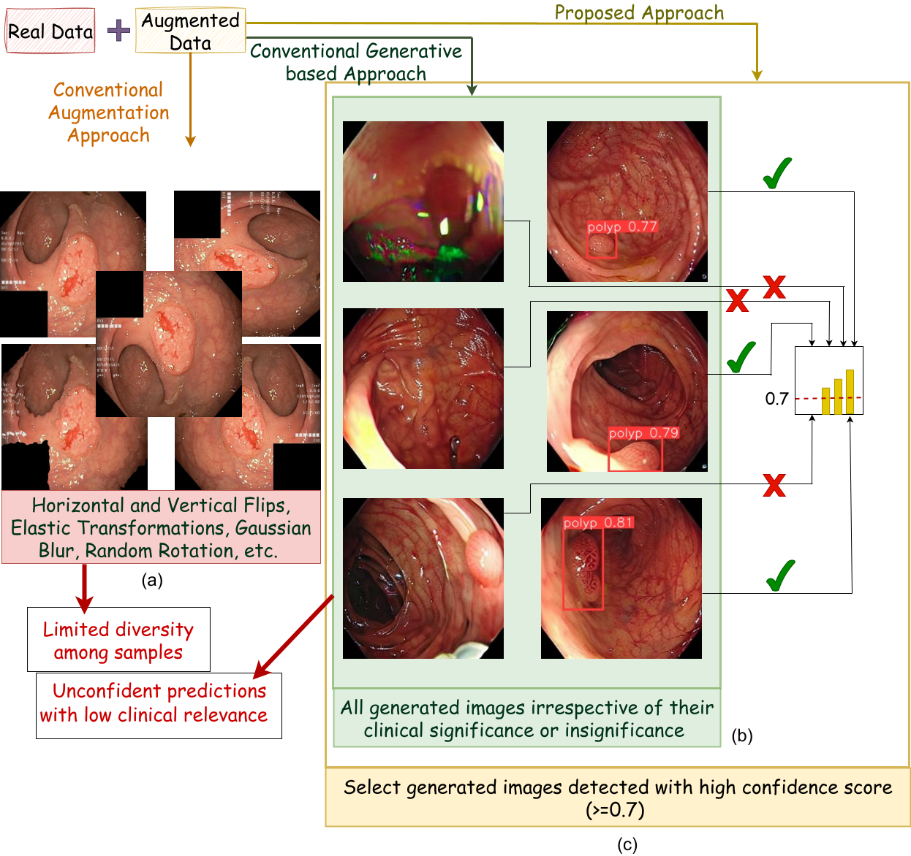

# ControlPolypNet: Towards Controlled Colon Polyp Synthesis for Improved Polyp Segmentation

Paper Link: [https://openaccess.thecvf.com/content/CVPR2024W/DCAMI/html/Sharma_ControlPolypNet_Towards_Controlled_Colon_Polyp_Synthesis_for_Improved_Polyp_Segmentation_CVPRW_2024_paper.html](https://openaccess.thecvf.com/content/CVPR2024W/DCAMI/html/Sharma_ControlPolypNet_Towards_Controlled_Colon_Polyp_Synthesis_for_Improved_Polyp_Segmentation_CVPRW_2024_paper.html)

## 1. Introduction

In recent years, generative models have been very popular in medical imaging applications because they generate realistic-looking synthetic images, which is crucial for the medical domain. These generated images often complement the hard-to-obtain annotated authentic medical data because acquiring such data requires expensive manual effort by clinical experts and raises privacy concerns. Moreover, with recent diffusion models, the generated data can be controlled using a conditioning mechanism, simultaneously ensuring diversity within synthetic samples. This control can allow experts to generate data based on different scenarios, which would otherwise be hard to obtain. However, how well these models perform for colonoscopy still needs to be explored. Do they preserve clinically significant information in generated frames? Do they help in downstream tasks such as polyp segmentation? Therefore, in this work, we propose ControlPolypNet, a novel stable diffusion based framework. We control the generation process (polyp size, shape and location) using a novel custom-masked input control, which generates images preserving important endoluminal information. Additionally, our model comprises a detection module, which discards some of the generated images that do not possess lesion characterising features, ensuring clinically relevant data. We further utilize the generated polyp frames to improve performance in the downstream task of polyp segmentation. Using these generated images, we found an average improvement of 6.84% and 1.3% (Jaccard index) on the CVC-ClinicDB and Kvasir-SEG datasets, respectively.

### Objective at a Glance!
<div align="center">
 
</div>

*Figure 1:  Controlling polyp generation using custom masks while leveraging largely accessible non-polyp/negative images. We turned negative samples into positive ones with controlled polyp shape, size and location.*

### General Comparison with Conventional Approaches

*Figure 2: Augmentation strategies; (a) Conventional augmentation techniques present limited diversity among samples, (b) Conventional generative approaches use all generated images irrespective of their clinical relevance, and (c) Our approach has an additional detection step that selects generated images which are detected with a high confidence score, ensuring clinical relevance.*

## 2. ControlPolypNet
- *ControlPolypNet* consists of three main parts: (a) Stable Diffusion U-Net architecture loaded with pre-trained weights of SD v1-5, (b) ControlNet, and (c) YOLOv8, a detector pre-trained on the polyp images. 
- To make the model learn the mapping $N' \rightarrow P'$, we prepared our training set such that initially, it learns $M \rightarrow P$.

*Figure 3: The proposed framework uses custom-masked images as input control with a ``polyp" text prompt. The pre-processing pipeline shows the elimination of uninformative negative frames. Custom masks are used to generate polyps during the evaluation phase of ControlPolypNet. The generated polyp images are fed to a YOLOv8 detector that selects clinically significant frames with a confidence score >= 0.7.*

### 3. Installation
```
git clone https://github.com/Vanshali/ControlPolypNet.git
pip install -r requirements.txt
```
### 4. Training
Step 1: You can create your input control for training (overlapped ground truth masks over images) using *create_mask_overlapped_images.py*. \
Step 2: To obtain bounding box labels for the input control (obtained from step 1) to train the detector, use *mask_to_bb.py*. \
Step 3: To use the pre-trained weights of SD v1-5, you can download them from https://huggingface.co/runwayml/stable-diffusion-v1-5/tree/main. You want the file "v1-5-pruned.ckpt". \
Step 4: As mentioned on the [ControlNet official GitHub page](https://github.com/lllyasviel/ControlNet/blob/main/docs/train.md), "all weights inside the ControlNet are also copied from SD so that no layer is trained from scratch, and you are still finetuning the entire model." Therefore, follow the below command if the SD filename is "./models/v1-5-pruned.ckpt" and you want to save the processed model (SD+ControlNet) at location "./models/control_sd15_ini.ckpt".
```
python3 tool_add_control.py ./models/v1-5-pruned.ckpt ./models/control_sd15_ini.ckpt
```
Step 5: To load the training set, prepare a JSON file similar to sample_train.json and provide its path in *dataset_train_load.py*. Here, the *source* represents the input control images prepared in step 1 and the *target* represents the original images without any overlapped mask. \
Step 6: Train the model using *train.py*. In the *resume_path* variable, you can provide the path to the checkpoint mentioned in step 4. Also, this variable can be used later to load the checkpoint of your trained model. Additionally, set a *default_root_dir* in line 40, where you want to save the model's checkpoints. \
Step 7: Evaluate the model according to the steps mentioned in the next section (5. Testing) and save the synthetically generated images. Further, to validate the clinical significance of the generated images, use the *Detector*. \
Step 8: You can either use the sample weights provided in the Detection folder (best.pt) directly and evaluate the generated images after loading the Detector with these weights, or you can train it on your dataset. You can check the [official page of YOLOv8](https://github.com/ultralytics/ultralytics/tree/main) for more details on training the detector. 

### 5. Testing
Step 1:  To load the test set, prepare a JSON file similar to sample_test.json and provide its path in *dataset_test_load.py*. Here, the *source* represents the custom-masked input control images (which you want to test) and the *target* is a dummy placeholder requiring some image path but will not be used anywhere (you can provide any dummy path). \
Step 2: Run *train.py* with max_epochs=0 in line 40 and set resume_path in line 14 to the path of the checkpoint you want to use for evaluation. \
Step 3: After obtaining the generated images, validate them through the Detector trained in section Training, step 8. 
```
yolo task=detect mode=val model=best.pt name=inference conf=0.7 data=custom.yaml imgsz=256 save_json=True plots=True
```

### Citation
Please cite our work if you find it useful.
```
@inproceedings{sharma2024controlpolypnet,
  title={ControlPolypNet: Towards Controlled Colon Polyp Synthesis for Improved Polyp Segmentation},
  author={Sharma, Vanshali and Kumar, Abhishek and Jha, Debesh and Bhuyan, MK and Das, Pradip K and Bagci, Ulas},
  booktitle={Proceedings of the IEEE/CVF Conference on Computer Vision and Pattern Recognition},
  pages={2325--2334},
  year={2024}
}

```
